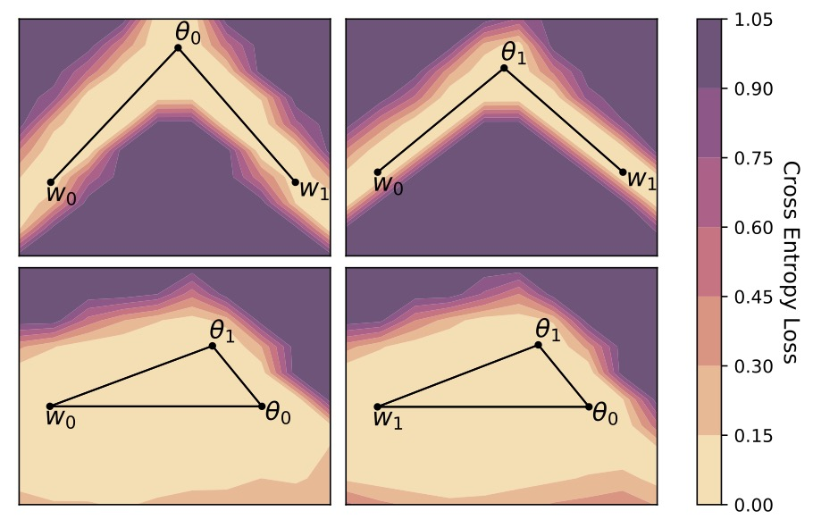
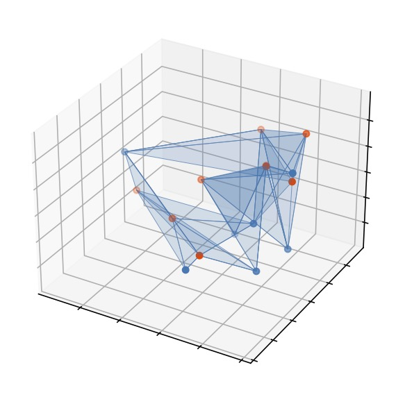

# Loss Surface Simplexes

This repository contains the code accompanying our paper [Loss Surface Simplexes for Mode Connecting Volumes and Fast Ensembling](https://arxiv.org/abs/2102.13042) by Greg Benton, Wesley Maddox, Sanae Lotfi, and Andrew Gordon Wilson.

## Introduction

The repository holds the implementation for Simplicial Pointwise Random Optimization (SPRO) as a method of finding simplicial complexes of low loss in the parameter space of neural networks. This work extends the approach of [Loss Surfaces, Mode Connectivity, and Fast Ensembling of DNNs](https://arxiv.org/abs/1802.10026) by Garipov et al. allowing us to find not just mode connecting paths but large intricate volumes of low loss that connect independently trained models in parameter space. 

<p float="center">
    
    
</p>

The left plot above shows loss surface projections along the edges and faces of a simplicial complex of low loss where  and  are independently trained VGG16 models on CIFAR-10, and  and  are connecting points trained with SPRO. The right plot shows a 3 dimensional projection of a simplicial complex containing 7 independently trained modes (orange) and 9 connecting points (blue) forming a total of 12 interconnected simplexes (blue shade) in the parameter space of a VGG16 network trained on CIFAR-100.

Beyond providing the ability to find multidimensional simplexes of low loss in parameter space our method introduces a practical method for improving accuracy and calibration over standard deep ensembles.

<p float="center">
    
</p>

For any fixed training budget or any fixed number of ensemble components we are able to outperform standard deep ensembles.

### Dependencies
* [PyTorch](http://pytorch.org/)
* [Torchvision](https://github.com/pytorch/vision/)
* [Tabulate](https://pypi.python.org/pypi/tabulate/)
* [GPyTorch](https://github.com/cornellius-gp/gpytorch)


## Usage and General Repository Structure

There are 2 main directories
- `experiments` contains the main directories to reproduce the core experiments of the paper,
- `simplex` contains the core code including mode definitions and utilities like training and evaluation functions.

### Experiments

#### `vgg-cifar10` and `vgg-cifar100`

These directories operate very similarly. Each contains several scripts: `base_trainer.py` for training VGG style networks on the corresponding dataset, `simplex_trainer.py` to train a simplex starting from one of the pre-trained models, and `complex_iterative.py` which takes in a set of pre-trained models and computes a mode connecting simplicial complex containing them. Finally, these directories contain `ensemble_trainer.py` which can be used to train an ensemble of simplexes in a single command. 

The specific commands to reproduce the results in the paper can be found in the READMEs in the corresponding directories.

### Simplex

The core class definition here is `SimplexNet` contained in `simplex/models/simplex_models.py`, which is an adaptation of the `CurveNet` class used in [Loss Surfaces, Mode Connectivity, and Fast Ensembling of DNNs](https://arxiv.org/abs/1802.10026) with the accompanying codebase [here](https://github.com/timgaripov/dnn-mode-connectivity). The `SimplexNet` class serves as a wrapper for a network such as `VGG16Simplex` in `simplex/models/vgg_noBN.py`, which will be stored as the attribute `SimplexNet.net`. 

The networks that have simplex base components (such as `VGG16Simplex`) hold each of the vertices of the simplex as their parameters and keep a list of `fix_points` that determine which of these vertices should recieve gradients for training.

Forward calls to a `SimplexNet` instance by default samples a set of parameters from within the simplex defined by the weight vectors in `SimplexNet.net`, and computes an output based on those parameters. Practically this means that if you call `SimplexNet(input)` repeatedly, you will get different results each time.

### Relevant Papers 

[Loss Surfaces, Mode Connectivity, and Fast Ensembling of DNNs](https://arxiv.org/pdf/1802.10026.pdf) by Timur Garipov, Pavel Izmailov, Dmitrii Podoprikhin, Dmitry Vetrov, Andrew Gordon Wilson

[Essentially No Barriers in Neural Network Energy Landscape](https://arxiv.org/pdf/1803.00885.pdf) by Felix Draxler, Kambis Veschgini, Manfred Salmhofer, Fred A. Hamprecht

[Large Scale Structure of Neural Network Loss Landscapes](https://arxiv.org/pdf/1906.04724.pdf) by Stanislav Fort, Stanislaw Jastrzebski

### Citation

If you use this work, please cite it as

```
@article{benton2021loss,
  title={Loss Surface Simplexes for Mode Connecting Volumes and Fast Ensembling},
  author={Benton, Gregory W and Maddox, Wesley J and Lotfi, Sanae and Wilson, Andrew Gordon},
  journal={arXiv preprint arXiv:2102.13042},
  year={2021}
}
```
